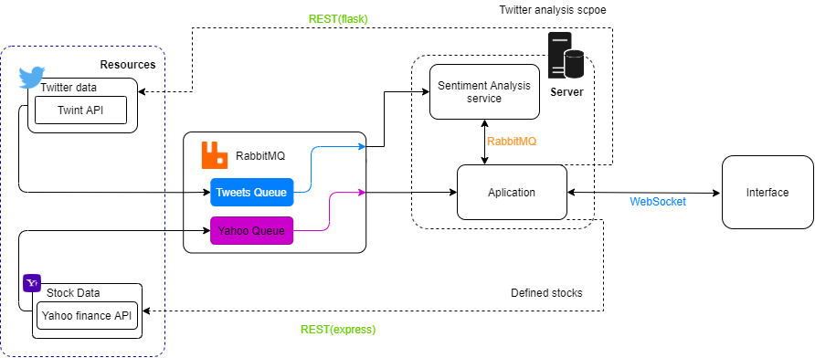

# TwitterStock
HACKATHON project of Cin UFPE discipline TASI-6 (IF1015) 

## Description
The main idea behind the project was to connect and find or sugest a relation between twitter trends or topics and stock prices, by showing multiple graphs to be analized by the user and custom searches to provide aditional data that can be utilized to its main purpose. 

## Technologies used
It was required for this project to mix knowledge from a pool of presented technologies, and the selected ones were 
1. WebSockets
2. REST
3. RabbitMQ



Some other technologies were used to make the application itself for example
- ReactJS
- Flask
- Node.js and Express
- Jupyter and ScikitLearn
- Twint and Yahoo-finance API's

## Current status

The project is not finished and there is a lot more that can be done to accomplish the main idea, like for example firing alerts and giving suggestions by making the application analyse some data by itself.

[Demonstration video](https://drive.google.com/file/d/18WIbghj3wrgTZ5yazS3UCMUyVgztVpbk/view?usp=sharing)


### Add twint dependencies

```
git clone --depth=1 https://github.com/twintproject/twint.git
cd twint
pip3 install . -r requirements.txt
```
